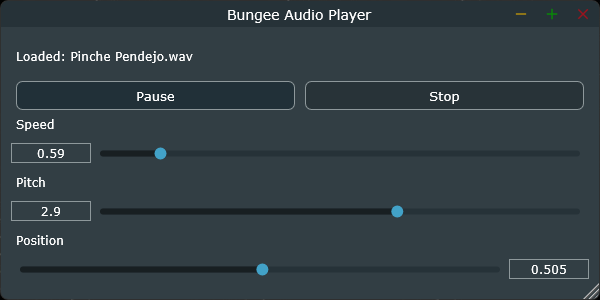

# Bungee Audio Player

This project is a proof of concept audio player based on [Juce](https://juce.com/) which utilizes the 
[Bungee Audio Time Stretcher Library](https://bungee.parabolaresearch.com/)
to provide time stretching and pitch shifting.

**Note**: This implementation utilizes a 'push' approach for processing data unlike the default 'pull' workflow Bungee suggests. This makes it more inline with how most time stretchers available work and is notably useful for audio streams.

Because this project is based on the [Pamplejuce](https://melatonin.dev/manuals/pamplejuce) template, you're welcome to use it as a base project for something like a sampler, or whatever you'd like.

If you found this project useful, please credit this author, I'd greatly appreciate it 🙇🏽‍♂️.

Out of the box, it:

1. Supports C++20.
2. Uses JUCE 8.x as a git submodule (tracking develop).
3. Relies on CMake 3.24.1 and higher for cross-platform building.
4. Ships with custom FIFO Buffer for buffering processed data.
4. Has [Catch2](https://github.com/catchorg/Catch2) v3.7.0 for the test framework and runner (not currently used but you're welcome to contribute).

It also contains:

1. A `.gitignore` for all platforms.
2. A `.clang-format` file for keeping code tidy.
3. A `VERSION` file that will propagate through JUCE and your app.
4. A ton of useful comments and options around the CMake config.

Check out the [official Pamplejuce documentation](https://melatonin.dev/manuals/pamplejuce/how-does-this-all-work/) for all the extra features this project inherits as well as how to build it.

## Getting Started

Currently, this project has only been built and tested on Windows. If you'd like to build and contribute the steps to get it working on other OS, please consider contributing.

1. Follow the [official Pamplejuce documentation](https://melatonin.dev/manuals/pamplejuce/how-does-this-all-work/) for how download initial dependencies. (Mostly need to download git submodules)
2. Download the latest [Bungee release](https://github.com/bungee-audio-stretch/bungee/releases).
3. Place header files in the `/include/bungee` directory.
4. Place lib and dll files in the `/lib/Windows/Release` directory.
5. Build the project with CMAke.

## License

MIT License

Copyright (c) 2022 AGM LTD

Permission is hereby granted, free of charge, to any person obtaining a copy
of this software and associated documentation files (the "Software"), to deal
in the Software without restriction, including without limitation the rights
to use, copy, modify, merge, publish, distribute, sublicense, and/or sell
copies of the Software, and to permit persons to whom the Software is
furnished to do so, subject to the following conditions:

The above copyright notice and this permission notice shall be included in all
copies or substantial portions of the Software.

THE SOFTWARE IS PROVIDED "AS IS", WITHOUT WARRANTY OF ANY KIND, EXPRESS OR
IMPLIED, INCLUDING BUT NOT LIMITED TO THE WARRANTIES OF MERCHANTABILITY,
FITNESS FOR A PARTICULAR PURPOSE AND NONINFRINGEMENT. IN NO EVENT SHALL THE
AUTHORS OR COPYRIGHT HOLDERS BE LIABLE FOR ANY CLAIM, DAMAGES OR OTHER
LIABILITY, WHETHER IN AN ACTION OF CONTRACT, TORT OR OTHERWISE, ARISING FROM,
OUT OF OR IN CONNECTION WITH THE SOFTWARE OR THE USE OR OTHER DEALINGS IN THE
SOFTWARE.
